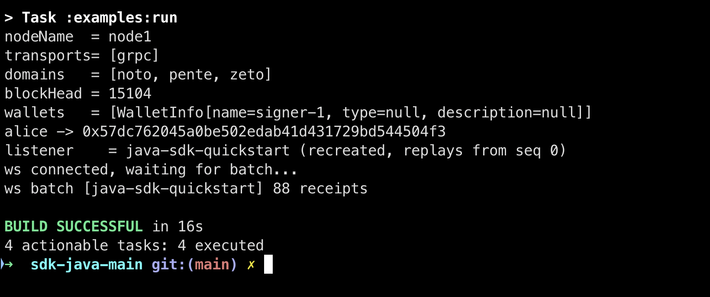
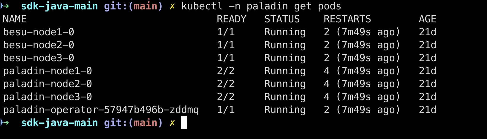
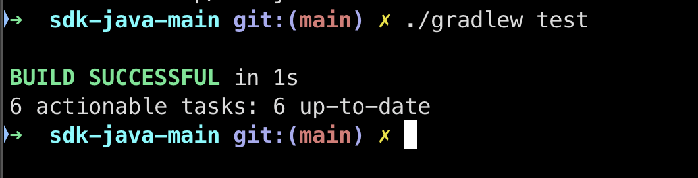
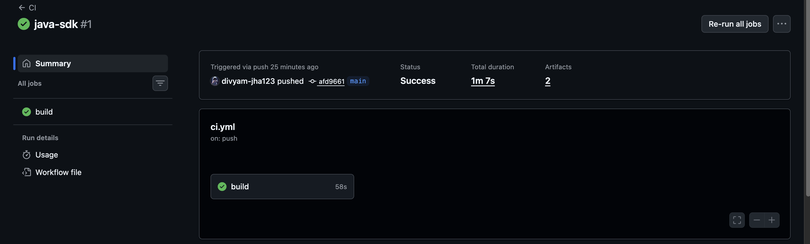

# Paladin Java SDK

Java client for the [LFDT Paladin](https://www.paladinprivacy.org/) programmable-privacy
platform. Wraps Paladin's JSON-RPC 2.0 API over HTTP (request/reply) and WebSocket
(subscriptions).

POC submitted in support of LFDT mentorship application
[#64 — Build and release a Java SDK for Paladin](https://github.com/LF-Decentralized-Trust-Mentorships/mentorship-program/issues/64).

**Status:** Java 17 · Gradle 8.10.2 · 16 / 16 unit tests pass · verified end-to-end against a live Paladin devnet · Apache-2.0

## Why

Paladin already ships SDKs for [Go](https://github.com/LFDT-Paladin/paladin/tree/main/sdk/go)
and [TypeScript](https://github.com/LFDT-Paladin/paladin/tree/main/sdk/typescript). This is the
same surface in Java, designed to drop into the Paladin monorepo as `sdk/java/`.

Every method name, request shape, and response type was derived from Paladin's existing SDK
source. The code maps 1:1 onto Paladin's JSON-RPC method namespace: `ptx_*`, `pgroup_*`,
`keymgr_*`, `pstate_*`, `bidx_*`, `reg_*`, `transport_*`, `domain_*`, `debug_*`.

### Live Example Run — SDK driving a real Paladin devnet




### Paladin Devnet Pods — 3 Paladin nodes + 3 Besu nodes running in Kind



### Running tests locally



## Quick start

```java
import io.lfdt.paladin.sdk.PaladinClient;
import io.lfdt.paladin.sdk.query.Query;
import io.lfdt.paladin.sdk.types.*;
import java.time.Duration;
import java.util.List;
import java.util.Map;

try (PaladinClient client = PaladinClient.builder()
        .url("http://localhost:31548")
        .basicAuth("paladin", "paladin")
        .build()) {

    String aliceAddr = client.ptx().resolveVerifier(
            "alice", Algorithms.ECDSA_SECP256K1, Verifiers.ETH_ADDRESS);

    String txId = client.ptx().sendTransaction(TransactionInput.builder()
            .type(TransactionType.PRIVATE)
            .domain("noto")
            .from("alice")
            .to("0xContractAddr")
            .function("transfer(address,uint256)")
            .data(Map.of("to", "bob", "amount", "100"))
            .build());

    TransactionReceipt receipt = client.ptx()
            .pollForReceipt(txId, Duration.ofSeconds(30))
            .orElseThrow();

    Query q = Query.builder().equal("source", aliceAddr).limit(20).sort("-sequence").build();
    List<TransactionReceipt> recent = client.ptx().queryTransactionReceipts(q);
}
```

### WebSocket subscriptions

```java
import io.lfdt.paladin.sdk.ws.*;

try (PaladinWebSocketClient ws = PaladinWebSocketClient.builder()
        .url("ws://localhost:31548/ws")
        .basicAuth("paladin", "paladin")
        .subscribe(SubscriptionType.RECEIPTS, "my-receipt-listener")
        .listener((sender, event) -> {
            System.out.println("Receipt batch: " + event.result());
            sender.ack(event.subscriptionId());
        })
        .build()) {
    ws.connect().get();
    Thread.currentThread().join();
}
```

## Architecture

```
PaladinClient
├── ptx()          ptx_*       send / prepare / call / query / receipts / ABI / decode / listeners
├── pgroup()       pgroup_*    privacy group create / send / call / messages
├── keymgr()       keymgr_*    wallets / key resolution / sign
├── pstate()       pstate_*    schemas / states / nullifiers
├── bidx()         bidx_*      block index / indexed events
├── reg()          reg_*       registry queries
├── transportRpc() transport_*
├── domain()       domain_*
├── debug()        debug_*
└── transport()    raw JsonRpcTransport for any method

PaladinWebSocketClient
└── subscribe(receipts | blockchainevents | messages)   ack / nack / auto-reconnect
```

## Build

```bash
./gradlew build                                            # compile, test, JaCoCo, jars
./gradlew :examples:run -PtargetUrl=http://localhost:31548
./gradlew publishToMavenLocal
```

`./gradlew build` produces three jars in `build/libs/`: main, sources, javadoc.

## Tests

```
HttpJsonRpcTransportTest      4   request shape / Basic auth / RPC error / async
PtxModuleTest                 6   send / get / query / poll-success / poll-timeout
PgroupModuleTest              1   createGroup wire shape
QueryTest                     2   filter DSL serialization
TransactionTypesTest          2   builder validation / enum wire values
PaladinWebSocketClientTest    1   real WS round-trip: subscribe → notification → ack
                              ──
                              16 / 16 PASSED
```

The WebSocket test runs a real `org.java_websocket` server inside the JVM and exercises the
full subscribe → push → ack loop. HTTP tests use OkHttp's `MockWebServer`.

## Live-node verification

The SDK was driven against a real Paladin devnet (Kind + Helm install of `paladin-operator`
and `paladin-crds` from the official Paladin Helm repo, three Paladin nodes + three Besu nodes
+ contract deployments). Output of `./gradlew :examples:run -PtargetUrl=http://localhost:31548`:

```text
nodeName  = node1
transports= [grpc]
domains   = [noto, pente, zeto]
blockHead = 87
wallets   = [WalletInfo[name=signer-1, type=null, description=null]]
alice -> 0x9ba1ea87c07a29061f5b2edb4d4cee2603fd1313
listener    = java-sdk-quickstart (recreated, replays from seq 0)
ws connected, waiting for batch...
ws batch [java-sdk-quickstart] 34 receipts
```

Methods exercised end-to-end: `transport_nodeName`, `transport_localTransports`,
`domain_listDomains`, `bidx_getConfirmedBlockHeight`, `keymgr_wallets`, `ptx_resolveVerifier`,
`ptx_getReceiptListener`, `ptx_createReceiptListener`, plus the full WebSocket subscribe →
notification → ack loop on `ptx_subscribe`. The 34-receipt batch is the chain history from
Paladin's contract bootstrap (Noto, Pente, Zeto factories).

To reproduce locally:

```bash
curl https://raw.githubusercontent.com/LFDT-Paladin/paladin/refs/heads/main/operator/paladin-kind.yaml -L -O
kind create cluster --name paladin --config paladin-kind.yaml
helm repo add paladin https://LFDT-Paladin.github.io/paladin --force-update
helm repo add jetstack https://charts.jetstack.io --force-update
helm upgrade --install paladin-crds paladin/paladin-operator-crd
helm install cert-manager --namespace cert-manager --version v1.16.1 jetstack/cert-manager \
    --create-namespace --set crds.enabled=true
helm upgrade --install paladin paladin/paladin-operator -n paladin --create-namespace
# wait until: kubectl -n paladin get pods → paladin-node{1,2,3}-0 are 2/2 Running
./gradlew :examples:run -PtargetUrl=http://localhost:31548
```

## Layout

```
sdk-java/
├── build.gradle              java-library + maven-publish + signing
├── settings.gradle
├── gradle.properties
├── src/main/java/io/lfdt/paladin/sdk/
│   ├── PaladinClient.java    facade + builder
│   ├── PaladinException.java exception hierarchy
│   ├── rpc/                  JSON-RPC 2.0 HTTP transport
│   ├── ptx/ pgroup/ keymgr/ pstate/ bidx/ reg/ transport/ domain/ debug/
│   ├── query/                filter DSL
│   ├── types/                wire types (TransactionInput, Receipt, …)
│   ├── ws/                   WebSocket subscription client
│   └── internal/             RpcModule base
├── src/test/java/            unit tests (MockWebServer + in-memory WS server)
├── examples/                 QuickStart runnable against a real node
└── .github/workflows/        CI (ci.yml) + Maven Central release (release.yml)
```

## Mapping to the existing SDKs

| TypeScript SDK                            | Java SDK                                     |
|-------------------------------------------|----------------------------------------------|
| `client.ptx.sendTransaction(input)`       | `client.ptx().sendTransaction(input)`        |
| `client.ptx.getTransactionReceipt(id)`    | `client.ptx().getTransactionReceipt(id)`     |
| `client.pgroup.createGroup(input)`        | `client.pgroup().createGroup(input)`         |
| `client.keymgr.resolveKey(id, alg, type)` | `client.keymgr().resolveKey(id, alg, type)`  |
| `client.pstate.queryStates(d, s, q, st)`  | `client.pstate().queryStates(d, s, q, st)`   |
| `client.bidx.getConfirmedBlockHeight()`   | `client.bidx().getConfirmedBlockHeight()`    |
| `new PaladinWebSocketClient({ ... })`     | `PaladinWebSocketClient.builder().build()`   |

## Release pipeline

`.github/workflows/release.yml` publishes signed artifacts to Maven Central via the Sonatype
Central Portal. Required repository secrets:


### CI — GitHub Actions build passing ✅




| Secret             | Purpose                            |
|--------------------|------------------------------------|
| `CENTRAL_USERNAME` | Sonatype Central Portal user token |
| `CENTRAL_PASSWORD` | Sonatype Central Portal token      |
| `SIGNING_KEY`      | ASCII-armored PGP private key      |
| `SIGNING_PASSWORD` | PGP key passphrase                 |

Trigger via `Actions → Release → Run workflow` with the version (e.g. `0.1.0`).

## License

Apache License 2.0. See [LICENSE](LICENSE).
